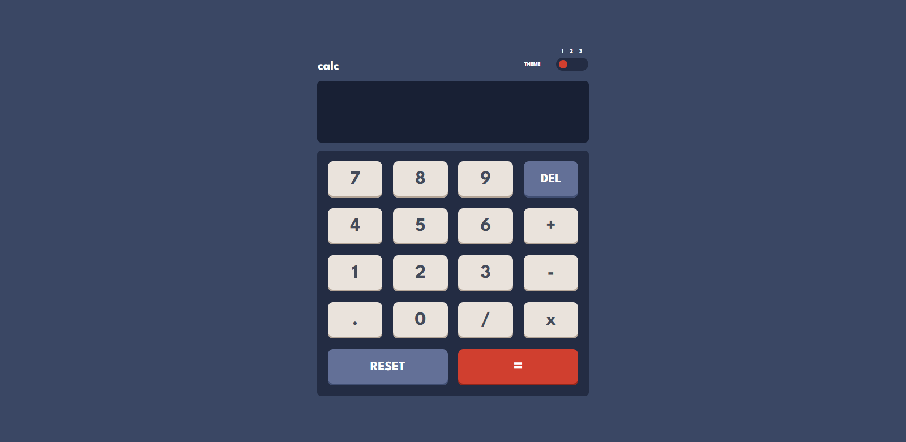

# Frontend Mentor - Calculator app solution

This is a solution to the [Calculator app challenge on Frontend Mentor](https://www.frontendmentor.io/challenges/calculator-app-9lteq5N29). Frontend Mentor challenges help you improve your coding skills by building realistic projects.

## Table of contents

- [Overview](#overview)
  [The challenge](#overview)
  [Screenshot](#desktop-screenshot)
  - [Links](#links)
- [My process](#my-process)
  - [Built with](#built-with)
  - [What I learned](#what-i-learned)
  - [Continued development](#continued-development)
- [Author](#author)

**Note: Delete this note and update the table of contents based on what sections you keep.**

## Overview

### The challenge

Users should be able to:

- See the size of the elements adjust based on their device's screen size
- Perform mathmatical operations like addition, subtraction, multiplication, and division
- Adjust the color theme based on their preference
- **Bonus**: Have their initial theme preference checked using `prefers-color-scheme` and have any additional changes saved in the browser

### Desktop Screenshot



### Links

- Solution URL: [Solution on frontend mentor](https://your-solution-url.com)
- Live Site URL: [Live on Github Pages](https://your-live-site-url.com)

## My process

### Built with

- HTML5 markup
- CSS custom properties
- Flexbox
- CSS Grid

### What I learned

I started by designing the grid container for the calculator. I used a grid for the calculator, body, keypad and also the theme-switch button.
I used the eval function to evaluate the textContent on calculator screen in string format.
The hardest part for me was making the theme switcher work. I just resorted to using 3 transparent button and added event listeners to each, to add the active class which highlights that button and also to change the theme class on html element.
To change the themes I put the theme changing class on html element.

```html
<html lang="en" class="theme-1" id="theme-switcher"></html>
```

Here is how I implemented the theme switching function.

```js
const themeSwitchBtns = document.getElementsByClassName("theme-switch-btn");
const themeSwitchControl = document.getElementById("theme-switcher");
let expression = "";

active(0);

function active(k) {
  for (let i = k; i < themeSwitchBtns.length; i++) {
    themeSwitchBtns[i].addEventListener("click", function () {
      themeSwitchBtns[i].classList.add("active");
      for (let j = 0; j < themeSwitchBtns.length; j++) {
        if (j != i) {
          themeSwitchBtns[j].classList.remove("active");
        }
      }
      themeSwitchControl.classList.add(`theme-${i + 1}`);
      for (let j = 1; j <= 3; j++) {
        if (j != i + 1) {
          themeSwitchControl.classList.remove(`theme-${j}`);
        }
      }
    });
  }
}
```

### Continued development

I need to learn how to write efficient functions in javascript and also practice more with handling the DOM elements. I struggled with writing clean and DRY code this time, I have to think about how I can avoid repeating my self when using multiple values to add or remove content.

## Author

- Frontend Mentor - [@yourusername](https://www.frontendmentor.io/profile/yourusername)
